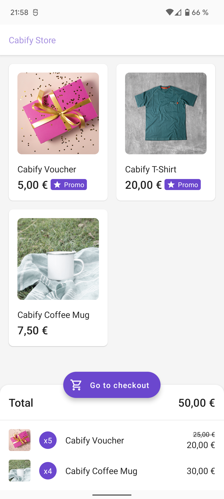
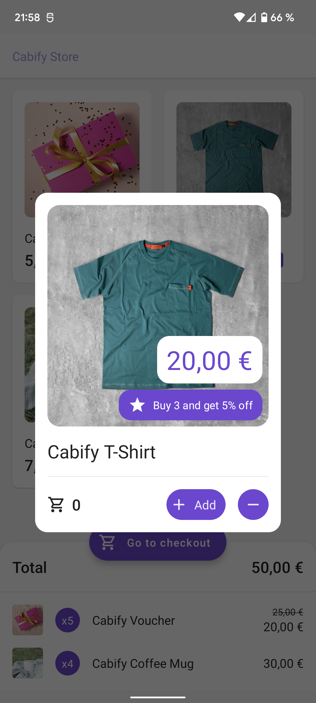
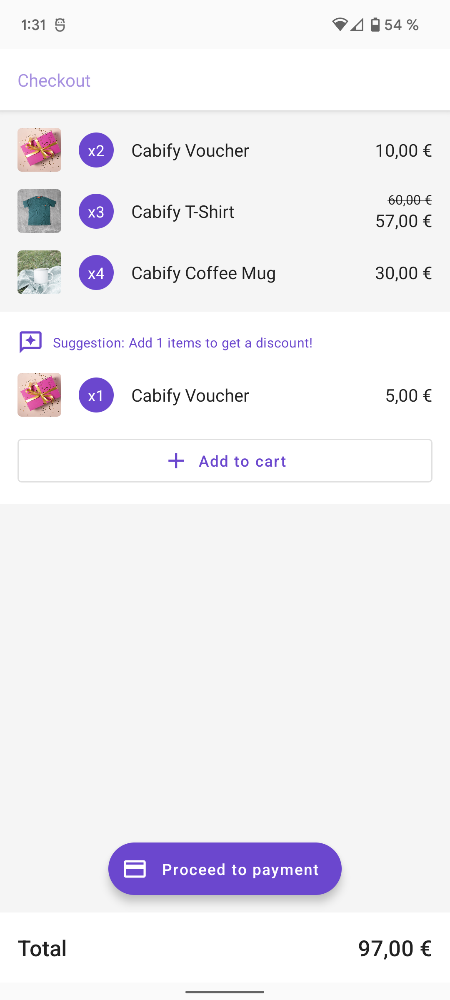

# Cabify Mobile Challenge

This is a Technical Challenge for Cabify. Product specifications are detailed
here: [CHALLENGE.md](.github/CHALLENGE.md)

# Solution

I have solved this challenge with a very simple design, but with some important details in a Product
level.

The solution is

  
   
  

### Test A/B

As you can check in the third screenshot, I'm showing suggestions to add a new product to the cart.
The algorithm is based in the following:

1. Every product in cart that have a discount, could be a suggestion to reach the discount rule.
2. From all the possible suggestions, it takes one or another based on different criteria:

* `GetSuggestionByMinValueUseCaseImpl`: It takes the one with lower cost for the user.
* `GetSuggestionByMinObjectsUseCaseImpl`: It takes the one with less objects needed to add to cart.

I'm not sure which algorithm is gonna work better, so I've "created" and A/B testing based on user
segments:

* `SUG_A`: `GetSuggestionByMinValueUseCaseImpl`
* `SUG_B`: `GetSuggestionByMinObjectsUseCaseImpl`

> You need to change manually your segment in UserRepository (It could be done from Firebase or server in a Production environment)

### Important considerations:

Some behaviors have been simplified for this Tech test, for example:

* `NetworkDiscountDatasource`: should get information about the discounts from the server.
* `UserRepositoryImpl`: should get information about the user segments from a datasource (server,
  firebase, whatever)
* Testing: I did not test for the whole project, I have only tested some parts as an example.

# Architecture

This project has been developed following CLEAN and SOLID principles. 
* Having a clear separation between layers, as you can see in Modules explanation.
* Decoupling code using Dependency Injection.
* Using a composable pattern for navigation.

### Modules
In order to have a good separation between layers (trying to impress you with a fantastic example of overengineering), I have divided the different layers and features into modules, I'm not gonna explain each module, but all of them are connected with `buildSrc` plugin. I think that's a super cool way of creating modules with a clear `build.gradle`, and syncrhonize project variables and dependencies.

### MVI
In my opinion one of the best architecture for using compose, and having a state that is the source of thruth for the UI.
`BaseViewModel` Is a good example of the way I use viewModels in a MVI architecture.

### Compose
The future and the present of modern Android development. With the adventages of using a declarative approach. 
I feel very confident with compose, I think it greatly reduces development times, and it allow to reuse views in a super easy way.

### Composable Architecture for Navigation
Being honest, that's new for me. In other projects I'm using compose, but always wrapped in fragments, with their own navigation and lifecycle.
This Tech-test is the first time I have the opportunity of experiment with navigation between compose views. 
My requirements for this research was:
* Easy navigation between modules.
* Navigation as decoupled as posible.
* MVI-friendly.

I'm very happy with the solution I've found:
* `NavigationManager` has ` MutableStateFlow<NavigationCommand>` listened from `MainActivity`, and every call will be forwarded to navigation to other view using [Jetpack Compose Navigation](https://developer.android.com/jetpack/compose/navigation)

# Libraries

I want to explain a bit about the libraries I used in this project and how:

### Dependency Inversion: [Hilt](https://developer.android.com/training/dependency-injection/hilt-android)

Becoming the standard way of handling with coupling in Android. I previously
used [Koin](https://insert-koin.io/) but Hilt is having more and more support from the community.

### Database: [JetPack DataStore](https://developer.android.com/topic/libraries/architecture/datastore)

Yes, I know I've used a Preferences library as a BBDD, I would do it
with [Room](https://developer.android.com/jetpack/androidx/releases/room), but I'm bored of using
Room, so I have taken the opportunity of using JetPack DataStore as the first time.

### Async Flow: [Flow & Coroutines](https://kotlin.github.io/kotlinx.coroutines/kotlinx-coroutines-core/kotlinx.coroutines.flow/-flow/)

The standard way of handling async calls and make a reactive app.

### Image Loader: [Coil](https://github.com/coil-kt/coil)

Designed in Kotlin for Kotlin with good support for Compose. I used to
use [Glide](https://github.com/bumptech/glide) but have been switching to Coil.

### Serialization: [Gson](https://github.com/google/gson)

One of the most popular JSON libraries for Android. But probably is time to move
to [Moshi](https://github.com/square/moshi). I did not use it for this test because I want to
evaluate the differences in depth.

### Network: [Retrofit](https://github.com/square/retrofit)

One of the most used libraries for network calls, I feel very confident with this library, and I use
it in all my projects.

### Functional Programming [Arrow](https://github.com/arrow-kt/arrow)

**I did not use this library** for this tech test because the benefits of functional programing are
more noticeable in medium and long term projects. Arrow is one of my favorite libraries to make
kotlin something more functional.

### Testing Mock: [Mockk](https://mockk.io/)

I don't know why but I have a slight preference for Mockk over Mockito.

